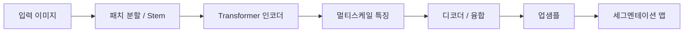
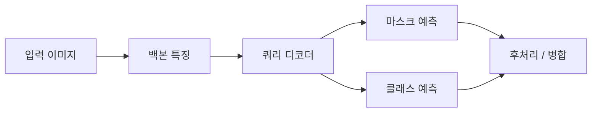

# Transformer-based Semantic Segmentation

이 문서는 비전 트랜스포머(ViT) 이후 등장한 **트랜스포머 기반 의미론적(semantic) / 인스턴스(instance) / 팬옵틱(panoptic) 세그멘테이션**의 개념, 설계 축, 대표 모델을 한곳에 정리한 참고 자료입니다. 같은 디렉터리의 SegFormer 구현 노트북과 연계해 읽으면 흐름을 잡기 좋습니다.

---

## 1. 왜 세그멘테이션에 Transformer인가

- **전역 문맥(global context)**: CNN의 수용 영역을 키우기 위해 깊은 네트워크·확장 컨볼루션·ASPP 등을 쓰던 것을, self-attention으로 더 직접적으로 모델링할 수 있습니다.
- **유연한 다중 스케일**: 계층적 ViT나 멀티스케일 특징 융합과 잘 맞습니다.
- **통합 프레임**: DETR 계열처럼 **객체를 쿼리로 예측**하는 방식을 세그멘테이션·검출에 확장하면, 파이프라인 단순화와 end-to-end 학습에 유리합니다.

한편 **연산량·메모리**가 크고, 고해상도 특징맵에 naive attention을 쓰면 비용이 폭발하므로, 실제 모델들은 **효율적 attention**, **패치/윈도우 단위**, **경량 디코더** 등으로 설계가 갈립니다.

---

## 2. 설계 축으로 보는 분류

| 축 | 설명 |
|----|------|
| **인코더** | ViT, Swin, ConvNeXt hybrid, MiT(Mix Transformer) 등 |
| **디코더** | MLP만 쓰는 경량 디코더 / 트랜스포머 디코더 / FPN 유사 융합 |
| **출력 표현** | 픽셀 단위 클래스 맵(per-pixel) / **마스크 분류(mask classification)** |
| **과제** | Semantic / Instance / Panoptic / Video |

---

## 3. 대표 접근법

### 3.1 인코더–디코더 + 픽셀 분류 (전통적 세그멘테이션 형태)

- ViT 백본으로 특징을 뽑고, **업샘플링·멀티스케일 융합**으로 해상도를 복원한 뒤 각 픽셀에 클래스를 부여합니다.
- **SETR** (SEgmentation TRansformer): ViT 인코더 + CNN식 디코더 변형으로 초기 시도 중 하나로 자주 인용됩니다.
- **SegFormer**: 효율적인 **계층적 MiT 인코더** + **경량 MLP 디코더**로 단순하면서 강한 베이스라인. 실시간에 가깝게 쓰기 좋은 계열입니다.

### 3.2 마스크 분류 (Mask classification)

- 각 **쿼리(query)**가 하나의 **마스크 + 클래스(또는 ∅)**를 예측합니다. DETR의 세그멘테이션 확장이라고 보면 됩니다.
- **MaskFormer**: 하나의 모델로 semantic·instance를 통합하는 방향의 기반이 됩니다.
- **Mask2Former**: 멀티스케일 특징에서 **masked attention** 등으로 정확도와 안정성을 끌어올린 후속작으로 널리 쓰입니다.

### 3.3 기타·응용

- **Panoptic FPN / Mask R-CNN 계열**과 트랜스포머 백본을 결합한 시스템.
- **비디오 세그멘테이션**: 시간 축 attention, 메모리 뱅크, 트래킹과 결합(예: 트랜스포머 기반 비디오 모델들)이 활발합니다.

---

## 4. 모델 간 러프 비교 (개념 수준)

| 이름 | 핵심 아이디어 | 비고 |
|------|----------------|------|
| **SETR** | ViT 특징 + 디코더로 픽셀 맵 | 초기 ViT 세그멘테이션 참고선 |
| **SegFormer** | MiT + MLP 디코더, 효율·단순성 | 학습/배포 균형이 좋음 |
| **MaskFormer** | 마스크 분류로 semantic/instance 통합 | 쿼리 기반 세그멘테이션 대표 |
| **Mask2Former** | 개선된 attention·멀티스케일 | 많은 벤치마크에서 강한 성능 |

수치 비교는 데이터셋·백본·해상도·학습 스케줄에 따라 달라지므로, 논문/공식 구현의 **동일 조건 표**를 참고하는 것이 좋습니다.

---

## 5. 전형적인 파이프라인 (개념도)

아래는 **인코더–디코더형** 세그멘테이션의 흐름을 단순화한 것입니다.

**마스크 분류 계열**은 대략 다음과 같이 이해할 수 있습니다.

---

## 6. 학습 시 자주 쓰는 요소

- **손실**: Cross-entropy, Focal loss, Dice / 조합(클래스 불균형 대응).
- **Mask 계열**: DETR류와 유사하게 **bipartite matching**(헝가리안 등)으로 쿼리와 GT를 매칭합니다.
- **증강**: RandAugment, 크롭, 다중 스케일 학습 등 CNN 세그멘테이션과 유사.
- **사전학습**: ImageNet·COCO 등 대규모로 학습된 백본을 쓰면 수렴과 성능에 유리한 경우가 많습니다.

---

## 7. 평가 지표 (요약)

| 지표 | 의미 |
|------|------|
| **mIoU** | 클래스별 IoU 평균 — semantic에서 가장 널리 씀 |
| **AP / AP_mask** | 인스턴스·팬옵틱에서 영역 품질 |
| **PQ** | Panoptic Quality — 세그멘테이션 + 인식 통합 |

---

## 8. 실무에서의 선택 가이드 (느낌)

- **속도·단순성·의미론적 세그멘테이션**: SegFormer 같은 **경량 디코더 + MiT/ViT** 계열을 먼저 검토.
- **인스턴스/팬옵틱·SOTA 추적**: Mask2Former 등 **마스크 분류** 계열과 공식 레시피를 참고.
- **해상도**: 입력 해상도와 메모리는 trade-off — attention 비용을 줄인 백본(Swin, 윈도우 attention 등)이 중요해집니다.

---

## 9. 참고 문헌·검색 키워드

검색 시 논문 제목과 함께 다음 키워드를 쓰면 최신 서베이·구현을 찾기 쉽습니다.

- `SETR segmentation transformer`
- `SegFormer` (NeurIPS 2021)
- `MaskFormer` / `Mask2Former`
- `mask classification segmentation`
- `panoptic segmentation transformer`

---

## 10. 이 폴더의 학습 자료와의 연결

| 자료 | 연결점 |
|------|--------|
| ViT 구현 노트북 | 패치 임베딩·트랜스포머 인코더 이해 |
| DETR 구현 노트북 | 쿼리·매칭·디코더 구조 — MaskFormer 계열의 선행 개념 |
| SegFormer 구현 노트북 | 본 문서의 **3.1**절과 직접 대응 |

---

*문서 목적: 개념 정리 및 로드맵. 특정 모델의 수식·레이어 설정은 해당 논문과 공식 코드를 우선하세요.*
